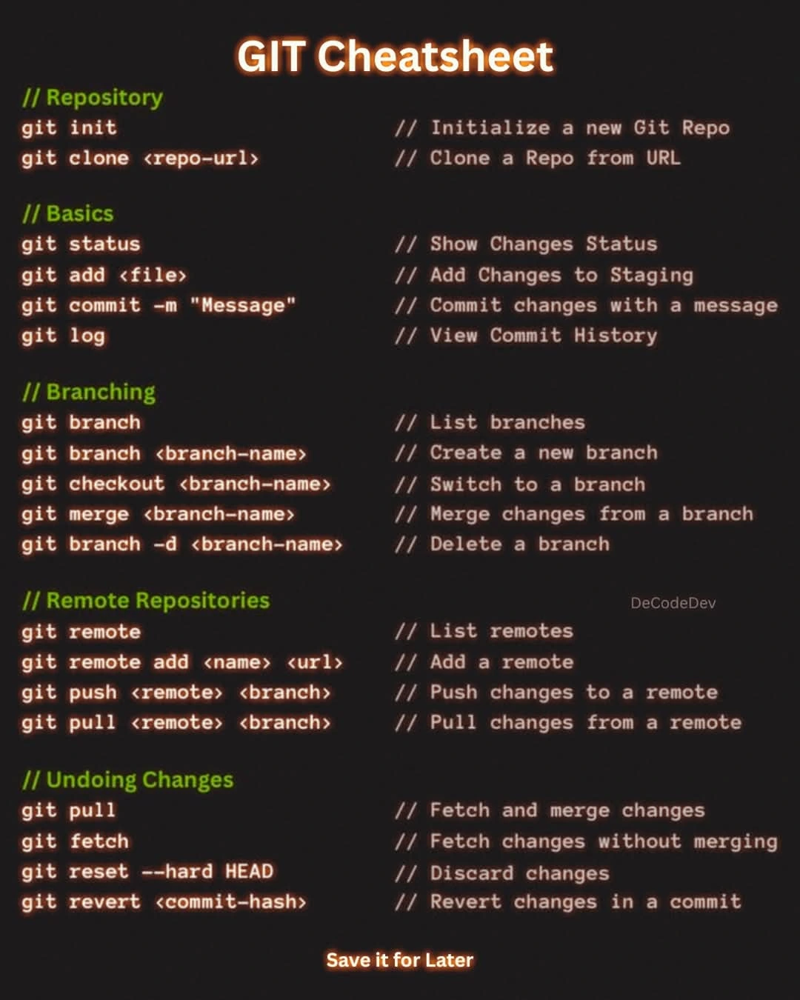

# Git & GitHub Full Course

  <strong>Don't Forget to ⭐ Star This Repository!</strong>

---

## 📄 Git Cheatsheet

---

## 💻 Git Commands Guide

### 1. `git init`
- **Fungsi**: Menginisialisasi repository Git di direktori lokal.
- **Contoh**: `git init`
- **Penjelasan**: Membuat repository Git baru di direktori saat ini.

### 2. `git clone`
- **Fungsi**: Mengunduh repository dari remote.
- **Contoh**: `git clone https://github.com/username/repo.git`
- **Penjelasan**: Menyalin repository dari remote ke lokal.

### 3. `git add`
- **Fungsi**: Menambahkan perubahan ke staging area.
- **Contoh**: `git add .` atau `git add <file>`
- **Penjelasan**: Menyiapkan file untuk di-commit.

### 4. `git commit -m "<pesan>"`
- **Fungsi**: Menyimpan snapshot dari staging area.
- **Contoh**: `git commit -m "Initial commit"`
- **Penjelasan**: Menyimpan perubahan dengan pesan deskriptif.

### 5. `git status`
- **Fungsi**: Menampilkan status file di repository.
- **Contoh**: `git status`
- **Penjelasan**: Menunjukkan file yang diubah, staged, atau untracked.

### 6. `git push`
- **Fungsi**: Mengirim commit ke repository remote.
- **Contoh**: `git push origin main`
- **Penjelasan**: Sinkronisasi branch lokal ke remote.

### 7. `git pull`
- **Fungsi**: Mengambil & menggabungkan perubahan dari remote.
- **Contoh**: `git pull origin main`
- **Penjelasan**: Update branch lokal dari remote.

### 8. `git branch`
- **Fungsi**: Menampilkan/membuat branch.
- **Contoh**: `git branch` atau `git branch new-feature`
- **Penjelasan**: Manajemen cabang pengembangan.

### 9. `git checkout`
- **Fungsi**: Beralih branch atau commit tertentu.
- **Contoh**: `git checkout main` atau `git checkout <commit>`
- **Penjelasan**: Navigasi antar branch atau versi.

### 10. `git merge`
- **Fungsi**: Menggabungkan branch ke branch aktif.
- **Contoh**: `git merge new-feature`
- **Penjelasan**: Menyatukan perubahan dari branch lain.

### 11. `git log`
- **Fungsi**: Melihat riwayat commit.
- **Contoh**: `git log`
- **Penjelasan**: Menampilkan daftar lengkap commit.

### 12. `git revert <commit>`
- **Fungsi**: Membatalkan perubahan dari commit tertentu.
- **Contoh**: `git revert <hash_commit>`
- **Penjelasan**: Membuat commit baru yang membalikkan perubahan.

### 13. `git reset`
- **Fungsi**: Mengembalikan repository ke commit sebelumnya.
- **Contoh**: `git reset --hard <commit>`
- **Penjelasan**: Reset branch ke commit tertentu (dapat membuang perubahan).

### 14. `git stash`
- **Fungsi**: Menyimpan sementara perubahan kerja.
- **Contoh**: `git stash`
- **Penjelasan**: Menyimpan perubahan sementara, bisa diambil kembali dengan `git stash pop`.

---

## 📚 Learn More

### SuperSimpleDev

### JavaScript Mastery

---

## 🙌 Credits
- [SuperSimpleDev](https://www.youtube.com/c/SuperSimpleDev)
- [JavaScript Mastery](https://www.youtube.com/c/javascriptmastery)
